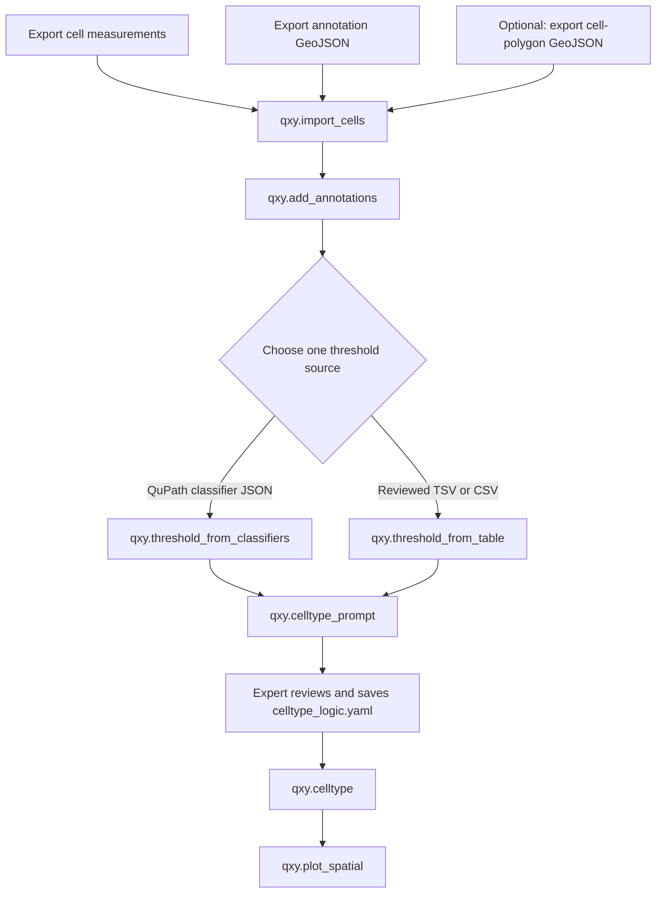

# QuPath quick start for QXYCell

Use this page for the common QuPath-to-QXYCell route: export cells and
annotations, choose a threshold source, review cell-type logic, and create a
spatial plot. The [detailed preparation guide](qupath_preparation.md) covers
segmentation review, TMA, troubleshooting, and special cases. For pixel
calibration and annotation rules, see [QuPath inputs, annotations, and
thresholds](qupath_inputs.md).

## 1. Export from QuPath

1. Export measurements for cells:
   1. Save the QuPath image data, then choose **Measure > Export
      measurements**.
   2. Select the project images and set **Export type** to cells.
   3. Export all columns, including the intended marker-intensity measurements.
   4. Save the result as `measurements.csv` or `measurements.tsv` inside the
      QuPath project folder. It must retain these columns:

   ```text
   Image
   Object ID
   Centroid X µm
   Centroid Y µm
   ```

2. Export sample, region, and optional `Ignore` annotations as one GeoJSON
   file per image:
   1. Select annotation objects only.
   2. Choose **File > Object data… > Export as GeoJSON** (or, in some QuPath
      0.7 installations, **File > Export objects as GeoJSON**).
   3. Export a GeoJSON `FeatureCollection` without measurements.
3. Optionally export cell polygons:
   1. Choose **Objects > Select > Select detections > Select cells**.
   2. Choose **File > Object data… > Export as GeoJSON** (or, in some QuPath
      0.7 installations, **File > Export objects as GeoJSON**).
   3. Export a GeoJSON `FeatureCollection` without measurements and retain the
      QuPath Object IDs.
4. Name each annotation or cell-polygon GeoJSON with its image stem. For example,
   `slide01.ome.tif` uses `slide01.geojson`.
5. Keep the measurement table and all GeoJSON files inside one QuPath project
   folder.

## 2. Import and add spatial data

Import the measurements and GeoJSON assets:

```python
import qxycell as qxy

project_dir = "/path/to/qupath_project"
adata = qxy.import_cells(project_dir)
qxy.add_annotations(adata)
```

`qxy.add_annotations()` imports annotation membership and any optional
cell-polygon GeoJSON. If the image pixel size differs from QXYCell's default,
follow the [pixel-calibration instructions](qupath_inputs.md#pixel-calibration)
before this step.

## 3. Choose one threshold source

Choose one final threshold source for a run: the classifier JSON values as
applied, or a reviewed threshold table. You can use classifier JSON values as
the starting point for a manually adjusted table; in that refinement route,
the reviewed table becomes the final source.

### Use QuPath classifier JSON files

Create and save one reviewed single-measurement classifier JSON per marker:

1. Choose **Classify > Object classification > Create single measurement
   classifier**.
2. Filter to cells and select the intended mean or median measurement.
3. Set the below/above-threshold classes, enable live preview, and review the
   result.
4. Save a short marker-based classifier name below the QuPath project folder.

Then run:

```python
qxy.threshold_from_classifiers(adata)
```

This writes the applied classifier values to
`thresholds/classifier_thresholds.tsv` in the active QXYCell output folder.

### Refine classifier-derived thresholds manually

Use this route when the QuPath classifier values are a useful starting point
but need adjustment:

1. Apply the classifier JSON files with `qxy.threshold_from_classifiers(adata)`.
2. Copy or rename the generated `thresholds/classifier_thresholds.tsv` file.
   Keep the original unchanged because another classifier run replaces it.
3. Edit the copied table manually, reviewing every marker and image threshold.
4. Apply the reviewed copy as the final threshold source:

   ```python
   qxy.threshold_from_table(adata, "/path/to/reviewed_thresholds.tsv")
   ```

### Use a reviewed threshold table

Generate or prepare one reviewed TSV or CSV with a threshold for every
required marker and image, then run:

```python
qxy.threshold_from_table(adata, "/path/to/reviewed_thresholds.tsv")
```

See [threshold sources](qupath_inputs.md#threshold-sources) for how to create
and review a threshold table.

## 4. Draft, review, and apply cell types

Generate a prompt containing the thresholded markers and study context:

```python
qxy.celltype_prompt(
    adata,
    context="Describe the tissue and expected populations",
)
```

Treat the generated YAML as a draft. A biology domain expert must review the
marker names, phenotypes, exclusions, rule order, and fallback behaviour before
saving it as `celltype_logic.yaml`. Then apply the reviewed rules and inspect a
plot:

```python
qxy.celltype(adata, "/path/to/celltype_logic.yaml")
qxy.plot_spatial(adata, category_col="celltype", show=False)
```

## Checklist

- [ ] Cell measurements include `Image`, `Object ID`, `Centroid X µm`, and
  `Centroid Y µm`.
- [ ] Annotation GeoJSON filename stems match their `Image` values.
- [ ] Optional cell-polygon GeoJSON retains the measurement-table Object IDs.
- [ ] One final threshold source was used: classifier JSON values or a reviewed
  table, including any manually refined classifier-derived table.
- [ ] The cell-type YAML was reviewed by a biology domain expert before use.
- [ ] A spatial overlay was inspected after import and cell typing.

## Workflow at a glance


