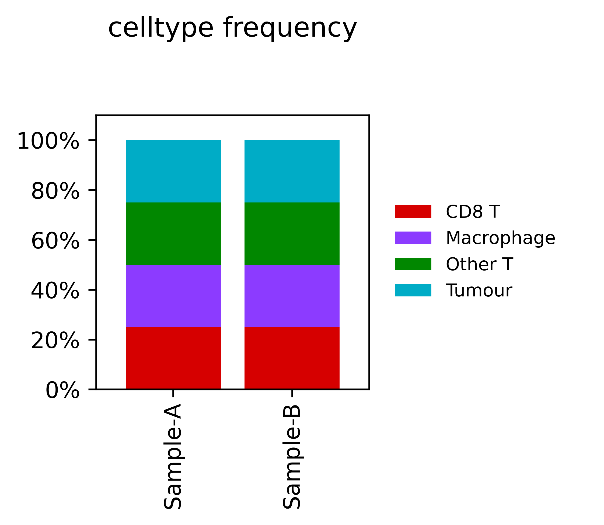
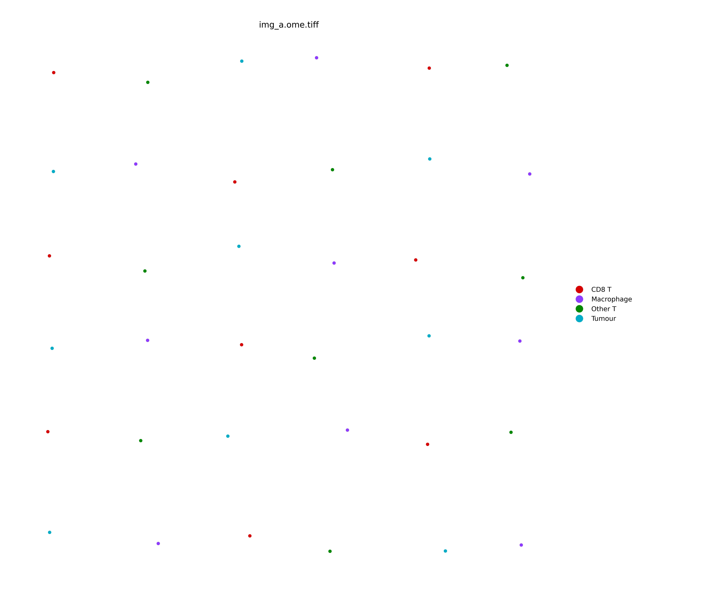
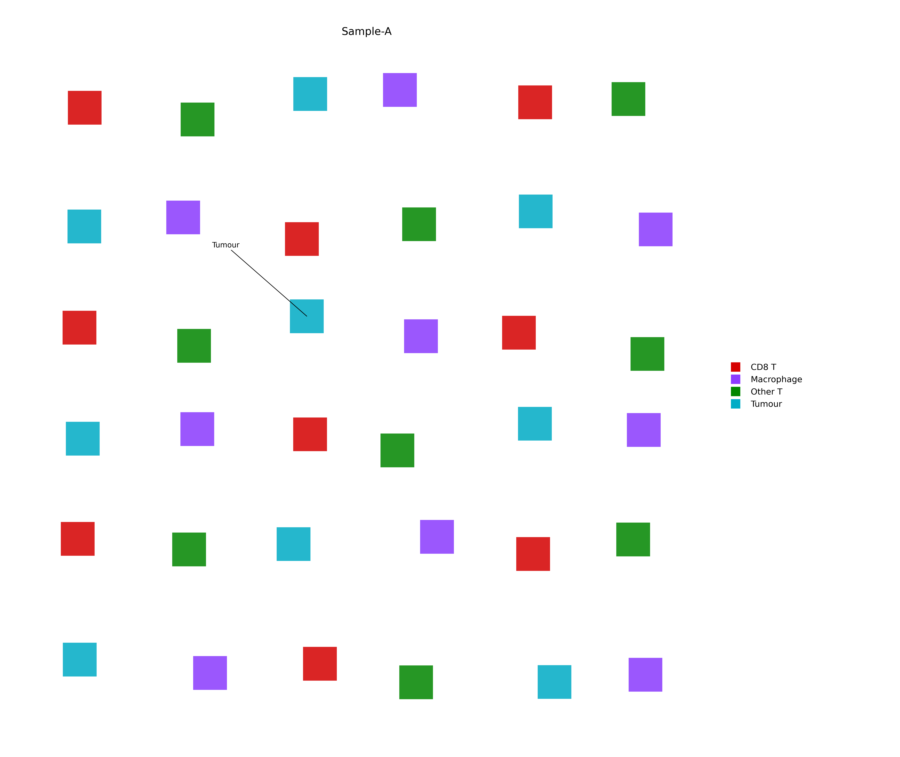
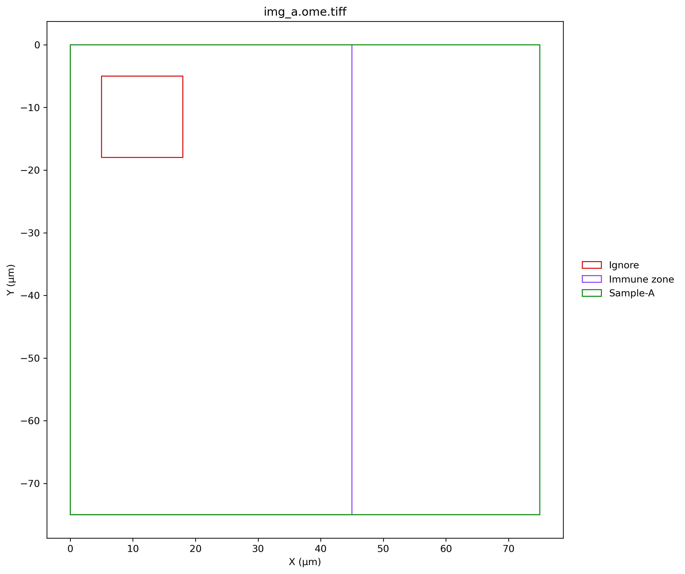
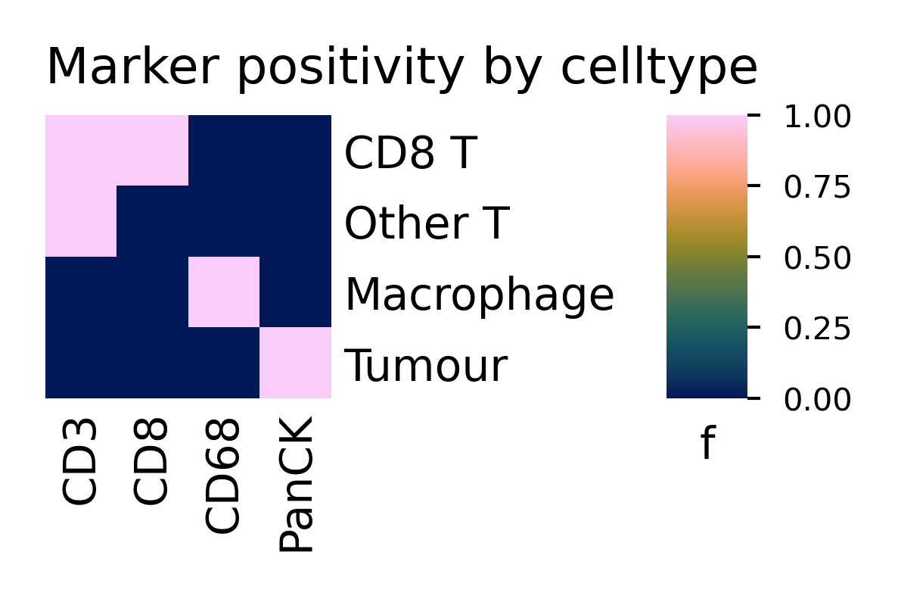
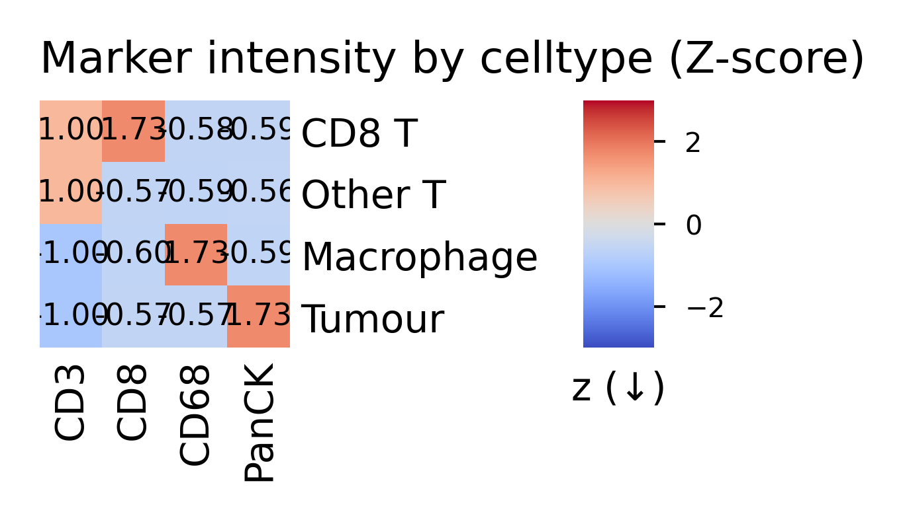
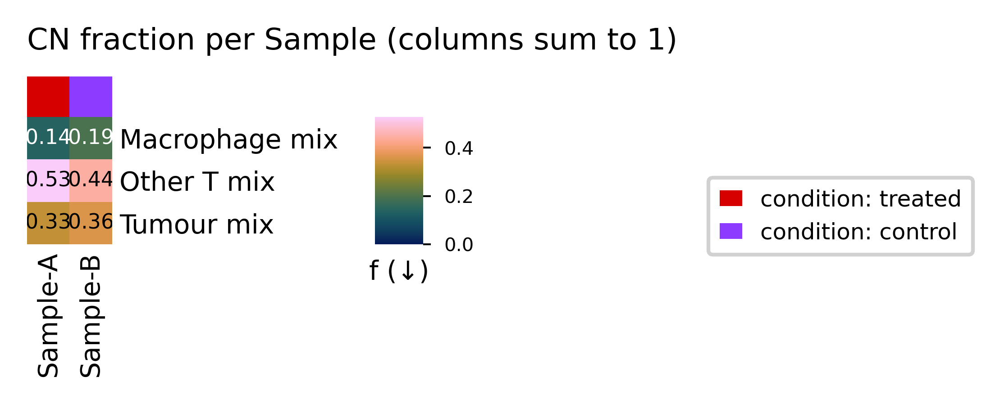

# QXYCell Function Examples

A Markdown reference for the public `qxy` API. Examples were generated from a small synthetic QuPath export and include real tables and plots produced by the current package code.

**Before using real data:** follow the [QuPath 0.7 multiplex-IF preparation guide](qupath_preparation.md) ([PDF](QXYCell_QuPath_Preparation_Guide.pdf)). Verify square-pixel calibration and pass it to `qxy.add_annotations(pixel_size_um=...)`; the default is `0.28` µm/pixel. These synthetic examples deliberately use `1.0`.

| Cells | Markers | Samples | Functions |
|---:|---:|---:|---:|
| 72 | 4 | 2 | 37 |

**Annotation and core rule shown here:** sample annotations collapse into one `Sample` column; Ignore and other annotations remain boolean `annotation__*` columns; the exact measurement-table `TMA Core` column automatically creates categorical `CoreID`.

## Example Dataset Preview

| index | Image | Object ID | Sample | CoreID | celltype | cn | condition |
|----|----|----|----|----|----|----|----|
| img_a.ome.tiff::img_a_cell_000 | img_a.ome.tiff | img_a_cell_000 | Sample-A | Sample-A-Core-1 | CD8 T | Tumour mix | treated |
| img_a.ome.tiff::img_a_cell_001 | img_a.ome.tiff | img_a_cell_001 | Sample-A | Sample-A-Core-2 | Other T | Tumour mix | treated |
| img_a.ome.tiff::img_a_cell_002 | img_a.ome.tiff | img_a_cell_002 | Sample-A | Sample-A-Core-1 | Tumour | Macrophage mix | treated |
| img_a.ome.tiff::img_a_cell_003 | img_a.ome.tiff | img_a_cell_003 | Sample-A | Sample-A-Core-2 | Macrophage | Other T mix | treated |
| img_a.ome.tiff::img_a_cell_004 | img_a.ome.tiff | img_a_cell_004 | Sample-A | Sample-A-Core-1 | CD8 T | Macrophage mix | treated |
| img_a.ome.tiff::img_a_cell_005 | img_a.ome.tiff | img_a_cell_005 | Sample-A | Sample-A-Core-2 | Other T | Macrophage mix | treated |
| img_a.ome.tiff::img_a_cell_006 | img_a.ome.tiff | img_a_cell_006 | Sample-A | Sample-A-Core-1 | Tumour | Other T mix | treated |
| img_a.ome.tiff::img_a_cell_007 | img_a.ome.tiff | img_a_cell_007 | Sample-A | Sample-A-Core-2 | Macrophage | Other T mix | treated |

## Marker Positivity Preview

| index                          | CD3_pos | CD68_pos | CD8_pos | PanCK_pos |
|--------------------------------|---------|----------|---------|-----------|
| img_a.ome.tiff::img_a_cell_000 | 1       | 0        | 1       | 0         |
| img_a.ome.tiff::img_a_cell_001 | 1       | 0        | 0       | 0         |
| img_a.ome.tiff::img_a_cell_002 | 0       | 0        | 0       | 1         |
| img_a.ome.tiff::img_a_cell_003 | 0       | 1        | 0       | 0         |
| img_a.ome.tiff::img_a_cell_004 | 1       | 0        | 1       | 0         |
| img_a.ome.tiff::img_a_cell_005 | 1       | 0        | 0       | 0         |
| img_a.ome.tiff::img_a_cell_006 | 0       | 0        | 0       | 1         |
| img_a.ome.tiff::img_a_cell_007 | 0       | 1        | 0       | 0         |

## Function Examples

### qxy.import_cells()

Stage 1: import QuPath cell measurements and spatial coordinates into the base AnnData checkpoint.

    adata = qxy.import_cells(project_dir, output_dir=out_dir)

| index | Image | Object ID | Sample | CoreID | celltype | cn | condition |
|----|----|----|----|----|----|----|----|
| img_a.ome.tiff::img_a_cell_000 | img_a.ome.tiff | img_a_cell_000 | Sample-A | Sample-A-Core-1 | CD8 T | Tumour mix | treated |
| img_a.ome.tiff::img_a_cell_001 | img_a.ome.tiff | img_a_cell_001 | Sample-A | Sample-A-Core-2 | Other T | Tumour mix | treated |
| img_a.ome.tiff::img_a_cell_002 | img_a.ome.tiff | img_a_cell_002 | Sample-A | Sample-A-Core-1 | Tumour | Macrophage mix | treated |
| img_a.ome.tiff::img_a_cell_003 | img_a.ome.tiff | img_a_cell_003 | Sample-A | Sample-A-Core-2 | Macrophage | Other T mix | treated |
| img_a.ome.tiff::img_a_cell_004 | img_a.ome.tiff | img_a_cell_004 | Sample-A | Sample-A-Core-1 | CD8 T | Macrophage mix | treated |
| img_a.ome.tiff::img_a_cell_005 | img_a.ome.tiff | img_a_cell_005 | Sample-A | Sample-A-Core-2 | Other T | Macrophage mix | treated |
| img_a.ome.tiff::img_a_cell_006 | img_a.ome.tiff | img_a_cell_006 | Sample-A | Sample-A-Core-1 | Tumour | Other T mix | treated |
| img_a.ome.tiff::img_a_cell_007 | img_a.ome.tiff | img_a_cell_007 | Sample-A | Sample-A-Core-2 | Macrophage | Other T mix | treated |

### qxy.add_annotations()

Stage 2: add or replace annotation, sample, and cell-polygon data using the verified pixel size.

    summary = qxy.add_annotations(adata, pixel_size_um=1.0)

| field                | value |
|----------------------|-------|
| pixel_size_um        | 1.0   |
| n_geojson_files      | 4.0   |
| n_annotation_columns | 3.0   |
| n_cell_polygons      | 72.0  |

### qxy.threshold_from_classifiers()

Stage 3A: apply only QuPath classifier JSON thresholds and save the applied values as a stable table.

    summary = qxy.threshold_from_classifiers(adata)

| field | value |
|----|----|
| threshold_source_kind | object_classifiers |
| n_threshold_definitions | 4 |
| n_pos_columns | 4 |
| generated_threshold_template | REPOSITORY_ROOT/docs/\_qxy_function_examples_build/outputs/synthetic_run_000000_0000/classifier_threshold_example/thresholds/classifier_thresholds.tsv |

### qxy.threshold_from_table()

Stage 3B: apply only one reviewed threshold table without falling back to classifier JSON files.

    summary = qxy.threshold_from_table(adata, 'thresholds.tsv')

| field | value |
|----|----|
| threshold_source_kind | manual_threshold_file |
| threshold_source | REPOSITORY_ROOT/docs/\_qxy_function_examples_build/outputs/synthetic_run_000000_0000/threshold_example/thresholds/thresholds_YYMMDD-HHMM.tsv |
| n_threshold_definitions | 8 |
| n_pos_columns | 4 |

### qxy.threshold()

Apply threshold definitions to an imported AnnData object, add \<marker\>\_pos columns, and rename previous cell type labels with a \_\_stale_celltype suffix.

    summary = qxy.threshold(adata, project_dir, output_dir=out_dir)

| field                   | value              |
|-------------------------|--------------------|
| threshold_source        | object_classifiers |
| n_threshold_definitions | 4                  |
| n_pos_columns           | 4                  |

### qxy.apply_thresholds()

Long-name alias for qxy.threshold().

    summary = qxy.apply_thresholds(adata, project_dir, output_dir=out_dir)

| field                   | value              |
|-------------------------|--------------------|
| threshold_source        | object_classifiers |
| n_threshold_definitions | 4                  |
| n_pos_columns           | 4                  |

### qxy.workflow()

Run the common Python workflow in one call.

    adata = qxy.workflow(project_dir, sample_metadata=metadata, celltype_logic='celltype_logic.yaml')

Workflow result: 72 cells after Ignore removal.

### qxy.check()

Inspect the export folder, list every annotation and planned AnnData assignment, and audit competing classifier thresholds without silently choosing one. Check never applies thresholds or cell typing and never generates an LLM prompt.

    report = qxy.check(project_dir, output_dir=out_dir, count_rows=True)

| metric            | value              |
|-------------------|--------------------|
| ok                | True               |
| threshold source  | object_classifiers |
| measurement files | 1                  |
| geojson files     | 4                  |

### qxy.generate_threshold_table()

Create a fresh timestamped threshold table. Conflicted channels retain candidate provenance and blank per-image cells until reviewed.

    threshold_path = qxy.generate_threshold_table(project_dir, output_dir=out_dir)

`REPOSITORY_ROOT/docs/_qxy_function_examples_build/outputs/synthetic_run_000000_0000/threshold_example/thresholds/thresholds_YYMMDD-HHMM.tsv`

### qxy.dataset_summary()

Write descriptive tables for cells, markers, annotations, samples, and cell types already present in AnnData.

    summary = qxy.dataset_summary(adata, sample_col='Sample', output_dir=out_dir)

| field | value |
|----|----|
| output_dir | REPOSITORY_ROOT/docs/\_qxy_function_examples_build/outputs/synthetic_run_000000_0000/dataset_summary |
| n_cells | 72 |
| sample_col | Sample |

### qxy.save()

Save an AnnData object to H5AD.

    h5ad_path = qxy.save(adata, output_dir=out_dir)

`REPOSITORY_ROOT/docs/_qxy_function_examples_build/outputs/synthetic_run_000000_0000/h5ad/qxycell.h5ad`

### qxy.load()

Load an H5AD from a file or QXYCell output folder.

    adata = qxy.load(out_dir)

Loaded shape: `(72, 4)`

### qxy.load_latest()

Load the newest qxy_outputs\_\* or \<project\>\_run\_\* folder in a base directory.

    adata = qxy.load_latest(base_output_dir)

Latest shape: `(72, 4)`

### qxy.assign_samples()

Create one Sample column from sample annotation labels.

    summary = qxy.assign_samples(adata)

| field               | value  |
|---------------------|--------|
| sample_col          | Sample |
| n_assigned_cells    | 72     |
| n_conflicting_cells | 0      |

### qxy.assign_annotations()

Collapse selected boolean annotation columns into one categorical observation column.

    summary = qxy.assign_annotations(adata, ['Immune zone', 'Tumour bed'], target_col='Region', drop=False)

| field               | value  |
|---------------------|--------|
| target_col          | Region |
| n_assigned_cells    | 48     |
| n_unassigned_cells  | 24     |
| n_conflicting_cells | 0      |

### qxy.assign_core_ids_from_measurements()

Create CoreID only from QuPath's measurement-table TMA Core column. Parent and annotations are never used.

    summary = qxy.assign_core_ids_from_measurements(adata)

| field                 | value        |
|-----------------------|--------------|
| target_col            | CoreID       |
| available_source_cols | \[TMA Core\] |
| n_assigned_cells      | 72           |
| n_unassigned_cells    | 0            |

### qxy.remove_cells()

Remove cells in annotation columns containing Ignore.

    clean = qxy.remove_cells(adata, copy=True)

Before: 72 cells. After copy: 71 cells.

### qxy.remove_annotations()

Remove cells in annotation columns matching a custom text string.

    clean = qxy.remove_annotations(adata, text='Immune', copy=True)

Before: 72 cells. After copy: 48 cells.

### qxy.load_cell_polygons()

Load cell boundary polygons from GeoJSON into cell_polygon_wkt.

    n = qxy.load_cell_polygons(adata, project_dir, pixel_size_um=1.0)

Matched polygons: `72`

### qxy.add_metadata()

Attach sample-level metadata to cells.

    qxy.add_metadata(adata, metadata, sample_col='Sample')

| field             | value                |
|-------------------|----------------------|
| n_matched_samples | 2                    |
| added_columns     | \[condition, batch\] |

### qxy.celltype()

Apply ordered cell type rules.

    summary = qxy.celltype(adata, 'celltype_logic.yaml')

| field           | value    |
|-----------------|----------|
| n_rules         | 4        |
| unknown_count   | 0        |
| celltype_column | celltype |

### qxy.apply_celltypes()

Public long-name alias for applying ordered cell type rules.

    summary = qxy.apply_celltypes(adata, 'celltype_logic.yaml')

| field           | value    |
|-----------------|----------|
| n_rules         | 4        |
| unknown_count   | 0        |
| celltype_column | celltype |

### qxy.load_celltype_logic()

Load cell typing YAML as a Python dict.

    logic = qxy.load_celltype_logic('celltype_logic.yaml')

    rules:
    - name: CD8 T
      positive:
      - CD3
      - CD8
    - name: Other T
      positive:
      - CD3
    - name: Tumour
      positive:
      - PanCK
    - name: Macrophage
      positive:
      - CD68
    features:
      immune_marker_positive:
        any_of:
        - CD3
        - CD68
    derived_features: {}

### qxy.find_latest_celltype_yaml()

Find the newest saved cell type YAML.

    path = qxy.find_latest_celltype_yaml(out_dir / 'celltype')

`REPOSITORY_ROOT/docs/_qxy_function_examples_build/outputs/synthetic_run_000000_0000/celltype/celltype_logic.yaml`

### qxy.CheckReport

Result type returned by qxy.check().

    isinstance(report, qxy.CheckReport)

`True`; errors: `0`; warnings: `0`

### qxy.celltype_prompt()

Generate a prompt for drafting cell type rules.

    prompt = qxy.celltype_prompt(adata, print_prompt=False)

    You are helping draft a first-pass QXYCell cell type logic YAML file for spatial single-cell data imported from QuPath.

    QXYCell has already loaded the project into an AnnData object. Marker positivity columns exist in `adata.obs` as `<MARKER>_pos`. Use only the marker names provided below exactly as written.

    Available markers:
    - CD3
    - CD68
    - CD8
    - PanCK

    Additional biological/project context:
    Small synthetic QXYCell demo with CD3, CD8, PanCK, and CD68.

    Return ONLY a valid YAML document inside a single fenced ```yaml code block.

    Critical formatting requirements:
    - Do not include explanatory text before or after the YAML.
    - Preserve YAML indentation exactly.
    - Do not convert YAML syntax into markdown bullet formatting.
    - YAML list items using `-` must remain literal plain-text YAML.
    - Do not use rich text formatting outside the YAML code block.

    Required structure:

    rules:
      - name: Ex\n...

### qxy.cn_knn()

Build cellular neighbourhood composition profiles.

    qxy.cn_knn(adata, k=5)

`adata.obsm['cn_profile']` shape: (72, 4)

### qxy.cn_kmeans()

Cluster neighbourhood profiles into CNs.

    qxy.cn_kmeans(adata, n_cn=3)

| cn             | n_cells |
|----------------|---------|
| Other T mix    | 35      |
| Tumour mix     | 25      |
| Macrophage mix | 12      |

### qxy.cn_name()

Rename CN clusters by their cell type composition.

    labels = qxy.cn_name(adata)

| CN_ID | CN_Label       | Top_Contributors                       |
|-------|----------------|----------------------------------------|
| N0    | Other T mix    | Other T 37%; CD8 T 30%; Tumour 22%     |
| N1    | Tumour mix     | Tumour 38%; Macrophage 35%; CD8 T 20%  |
| N2    | Macrophage mix | Macrophage 40%; Other T 33%; CD8 T 17% |

### qxy.plot_stacked_bar()

Plot cell type frequencies by sample.

    qxy.plot_stacked_bar(adata, sample_col='Sample', show_axis_labels=False, show=False)



### qxy.plot_spatial()

Plot spatial cell locations by category. Missing sample labels are excluded by default; underlay_adata can provide a full-data grey underlay for a filtered plot object.

    qxy.plot_spatial(adata_cn, underlay_adata=adata, sample_col='Sample', category_col='cn', show=False)



### qxy.plot_cell_boundaries()

Plot cell boundary polygons by category.

    qxy.plot_cell_boundaries(adata, sample_col='Sample', label_celltypes='Tumour', save_pdf=False, show=False)



### qxy.plot_annotation_polygons()

Reload QuPath annotation geometry for PNG-only QC. Defaults to a low-resolution cell-density underlay and boundary-only polygons (fill=False).

    qxy.plot_annotation_polygons(adata, show=False)



### qxy.plot_marker_positivity_heatmap()

Plot positive-cell count divided by category cell count for each thresholded marker (0–1).

    qxy.plot_marker_positivity_heatmap(adata, annotate=True, show=False)



### qxy.plot_marker_intensity_heatmap()

Plot category mean intensity followed by per-marker Z-scoring. This is not a median or count heatmap.

    qxy.plot_marker_intensity_heatmap(adata, annotate=True, show=False)



### qxy.plot_marker_heatmap()

Compatibility entry point for older code. New code should call the explicit positivity or intensity function.

    qxy.plot_marker_heatmap(adata, values='positivity', show=False)


### qxy.plot_cn_heatmap()

Plot CN abundance heatmap across samples.

    qxy.plot_cn_heatmap(adata, sample_col='Sample', condition_col='condition', show=False)


